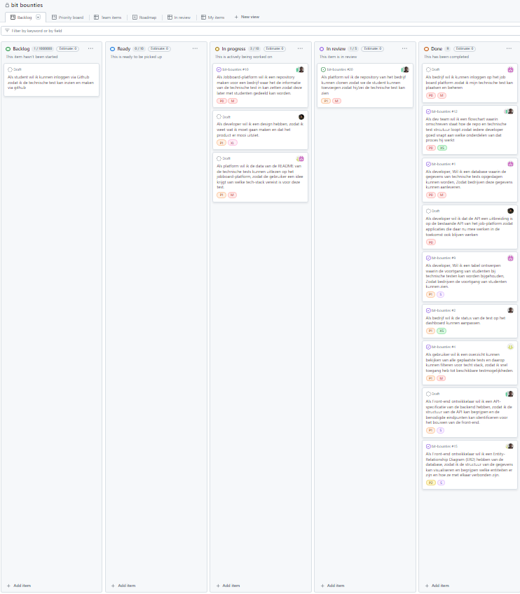

# Bit Bounties - Over het Project

## Wie doet wat?
- Opdrachtgever: Joris Schelfhout
- Projectleider: Ties Noordhuis
- Project naam: Bit Bounties

## Wat gaan we maken?
We gaan het NexEd job-board beter maken. We maken een plek waar:
- Bedrijven programmeertests kunnen plaatsen
- Studenten deze tests kunnen maken
- Als studenten de tests goed maken, kunnen ze een stageplek krijgen

## Wat moet het kunnen?

### Voor bedrijven:
- Tests maken en online zetten
- Zien wie de tests heeft gemaakt
- Inloggen via het job-board

### Voor studenten:
- Tests zoeken op programmeertaal (bijvoorbeeld Java of PHP)
- Tests maken via GitHub
- Inloggen met GitHub
- Alle tests en bedrijven bekijken

### Extra functies:
- Tests worden bewaard in een makkelijk leesbaar formaat
- Tests kunnen automatisch gemaakt worden met AI (als we tijd hebben)

## Welke programmeertalen gebruiken we?

### Basis talen:
- TypeScript
- JavaScript
- HTML
- CSS
- PHP

### Extra tools die we gebruiken:
- Next.js (voor de website)
- TailwindCSS (voor de opmaak)
- OAuth 2.0 (voor veilig inloggen)
- Laravel (voor de achterkant)
- MySQL (voor de database)

---

## Wat gaan we precies maken?

### Hoe lang duurt iets?
We gebruiken deze tijden om te plannen:
- **Klein (S)**: 1 dag werk
- **Middel (M)**: 2-3 dagen werk
- **Groot (L)**: 1 week werk
- **Extra Groot (XL)**: 2 weken werk

### Lijst met taken

| Nr  | Wie?               | Wil wat?                                                    | Waarom?                                                    | Kan het?         | Hoe belangrijk? | Hoe lang?     |
|-----|--------------------|------------------------------------------------------------|------------------------------------------------------------|--------------------|----------------|---------------|
| 1   | Job-board         | Een plek maken waar bedrijven tests kunnen zetten          | Zodat studenten de tests kunnen vinden                      | Ja, met GitHub     | Heel erg       | 2 weken       |
| 2   | Website           | Tests kunnen lezen                                         | Om te zien welke programmeertalen nodig zijn               | Ja                 | Heel erg       | 2-3 dagen     |
| 3   | Programmeur       | Weten hoe de website werkt                                | Om de voorkant te kunnen maken                              | Ja                 | Best wel       | 1 dag         |
| 4   | Team              | Een mooi ontwerp                                          | Zodat de website er goed uitziet                            | Ja                 | Best wel       | 1 week        |
| 5   | Website           | Tests kunnen kopiëren                                     | Zodat studenten eraan kunnen werken                         | Ja                 | Heel erg       | 1 week        |
| 6   | Programmeur       | Bijhouden hoe ver studenten zijn                          | Zodat bedrijven kunnen zien wie goed is                     | Ja                 | Best wel       | 1 dag         |
| 7   | Programmeur       | Een plan voor de database                                 | Om te weten hoe we alles opslaan                            | Ja                 | Best wel       | 1 dag         |
| 8   | Team              | Een tekening van hoe alles werkt                         | Zodat iedereen snapt wat we doen                            | Ja                 | Best wel       | 1 dag         |
| 9   | Programmeur       | Een plek om tests op te slaan                            | Zodat bedrijven tests kunnen maken                          | Ja                 | Heel erg       | 2-3 dagen     |
| 10  | Team              | De website uitbreiden                                     | Zodat alles goed samenwerkt                                 | Ja                 | Heel erg       | 1 week        |
| 11  | Bedrijf           | Tests kunnen aanpassen                                    | Om bij te houden hoe het gaat                               | Ja                 | Best wel       | 1 dag         |
| 12  | Student           | Tests kunnen zoeken                                       | Om snel de juiste test te vinden                            | Ja                 | Best wel       | 2-3 dagen     |
| 13  | Student           | Kunnen inloggen met GitHub                                | Om tests te kunnen maken                                     | Ja                 | Heel erg       | 1 week        |
| 14  | Bedrijf           | Kunnen inloggen op de website                            | Om tests te kunnen maken en beheren                         | Ja                 | Heel erg       | 2-3 dagen     |

## Wanneer is iets klaar?

### Een plek voor bedrijven maken (Taak 1)
- Er is een systeem dat automatisch een plek maakt voor elk bedrijf
- Er staat een duidelijke uitleg bij hoe alles werkt

### Tests kunnen lezen (Taak 2)
- De website kan alle tests lezen
- Je kunt zien welke programmeertalen nodig zijn
- Als er iets fout gaat, wordt dat netjes opgeschreven

### Website handleiding (Taak 3)
- Er is een duidelijke uitleg voor programmeurs
- Alles is goed getest
- Het is veilig

### Tests kopiëren (Taak 5)
- Tests kunnen automatisch gekopieerd worden
- Je kunt zien of het kopiëren gelukt is
- Alles blijft veilig

### Voortgang bijhouden (Taak 6)
- Je ziet meteen hoe ver iedereen is
- Je kunt makkelijk dingen opzoeken
- Je kunt lijsten maken van hoe het gaat

### Database plan en tekening (Taak 7 & 8)
- Het plan is up-to-date
- Iedereen in het team snapt het
- Als er iets verandert, wordt het plan aangepast

[Waar staat alles?](https://github.com/praxand/bit-bounties)

[Takenlijst](https://github.com/users/praxand/projects/1/views/1)

Bob kan bij het project omdat het privé moet blijven van Joris. Het project zit ook in een zip bestand in deze map.

