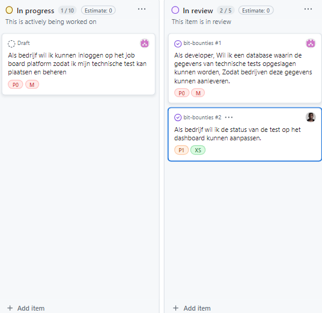
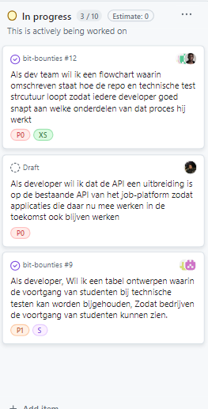

# Bit Bounties - Planning

We hebben deze planning gemaakt op basis van onze taken.

## Wat doen we wanneer?

| Week | Wat gaan we doen? |
|------|------------------|
| 1    | **Begin van het project**. We maken een plan, tekenen hoe de database eruit moet zien, maken een plek op GitHub, schrijven op wat we moeten maken en maken een takenlijst. |
| 2    | **Belangrijke onderdelen maken**. We maken dat bedrijven kunnen inloggen, maken een plek om tests op te slaan, en zorgen dat bedrijven kunnen zien hoe het gaat met de tests. |
| 3    | **Website beter maken**. We maken een tekening van hoe alles werkt, breiden de website uit, en maken een plek waar we kunnen zien hoe goed studenten het doen. |
| 4    | **Website mooi maken**. We zorgen dat je alle tests kunt zien en zoeken, leggen uit hoe de website werkt voor programmeurs, en maken de tekening van de database af. |
| 5    | **Tests klaarmaken**. We zorgen dat tests gekopieerd kunnen worden voor studenten, maken plekken waar bedrijven tests kunnen neerzetten, en zorgen dat we alle tests kunnen lezen op de website. |

## Wat hebben we elke week gedaan?

### Week 1: Begin van het project
- Plan gemaakt
- Database getekend
- GitHub klaargezet
- Opgeschreven wat we moeten maken
- Takenlijst gemaakt

### Week 2: Belangrijke onderdelen maken
- **Wat is er af**:
  - Bedrijven kunnen inloggen op de website
  - Tests kunnen worden opgeslagen
  - Bedrijven kunnen zien hoe het gaat met de tests

### Week 3: Website beter maken
- **Wat is er af**:
  - Een tekening gemaakt zodat iedereen snapt hoe alles werkt
  - De website werkt nu samen met andere websites
  - We kunnen zien hoe goed studenten het doen met de tests

### Week 4: Website mooi maken
- **Wat is er af**:
  - Je kunt alle tests zien en zoeken op programmeertaal
  - Programmeurs weten nu hoe ze de website moeten gebruiken
  - De tekening van de database is klaar

### Week 5: Tests klaarmaken
- **Wat is er af**:
  - Tests kunnen gekopieerd worden voor studenten
  - Bedrijven hebben een eigen plek voor hun tests
  - We kunnen alle tests lezen op de website

## Welke taken doen we in welke week?

| Week 1 | Week 2  | Week 3 | Week 4  | Week 5  |
|--------|---------|---------|----------|----------|
|        | Taak 14 | Taak 8  | Taak 12  | Taak 5   |
|        | Taak 9  | Taak 10 | Taak 3   | Taak 1   |
|        | Taak 11 | Taak 6  | Taak 7   | Taak 2   |

## Foto's van week 2 en 3

