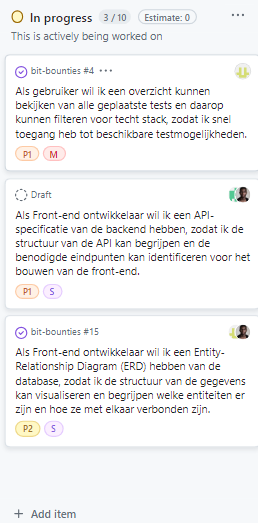
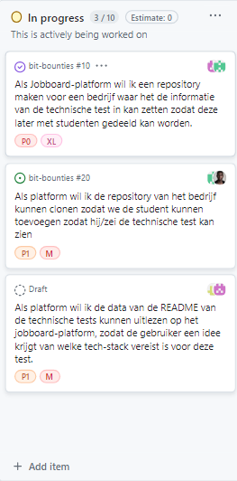

# Bit Bounties - Hoe gaat het met het project?

## Hoe houden we bij of alles goed gaat?

Bij Bit Bounties kijken we elke dag hoe het gaat. We doen dit op verschillende manieren:

### Wat doen we om alles in de gaten te houden?

- **Korte dagelijkse praatjes**: Elke dag praten we even met elkaar over wat we hebben gedaan en of er problemen zijn
- **Wekelijkse grote bespreking**: Aan het eind van de week kijken we wat er klaar is en maken we een plan voor de volgende week
- **Online takenlijst**: We hebben een lijst op de computer waar iedereen kan zien wat er moet gebeuren

## Hoe ging het elke week?

**Week 1: Het begin**
- **Wat moesten we doen?**: Plan maken en alles klaarzetten
- **Wat is er gelukt?**: We hebben een goed plan gemaakt en alles staat klaar om te beginnen
- **Wat hebben we geleerd?**: We hebben extra tijd besteed aan het tekenen van de database, dat was een goed idee

**Week 2: De basis maken**
- **Wat moesten we doen?**: Zorgen dat mensen kunnen inloggen en dat we tests kunnen opslaan
- **Wat is er gelukt?**: Inloggen werkt en we kunnen tests veilig opslaan
- **Wat hebben we geleerd?**: We hebben extra goed gekeken of het inloggen veilig werkt

**Week 3: De website uitbreiden**
- **Wat moesten we doen?**: De website beter maken en verbinden met andere delen
- **Wat is er gelukt?**: De website werkt nu goed samen met andere delen
- **Wat hebben we geleerd?**: We hebben meer tijd besteed aan het maken van de verbindingen, dat was nodig

**Week 4: Alles mooi maken**
- **Wat moesten we doen?**: De website mooier maken en testen of alles goed werkt
- **Wat is er gelukt?**: De website ziet er nu mooi uit en werkt goed
- **Wat hebben we geleerd?**: Door goed te luisteren naar wat mensen ervan vonden, konden we het meteen beter maken

**Week 5: De tests maken**
- **Wat moesten we doen?**: Zorgen dat bedrijven tests kunnen maken en dat studenten ze kunnen doen
- **Wat is er gelukt?**: Het maken van een plek voor tests duurde langer dan we dachten
- **Wat hebben we geleerd?**: We hebben meer tijd besteed aan het maken van de tests omdat dit heel belangrijk is

