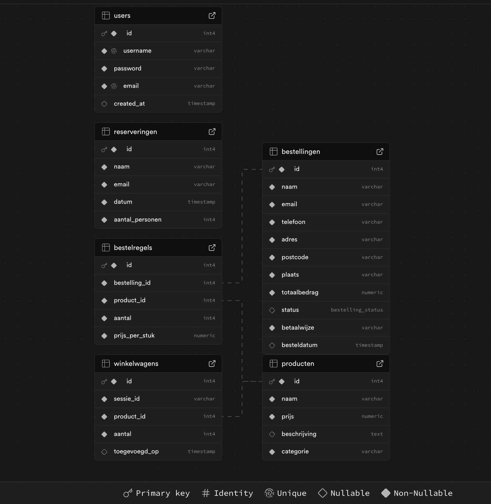
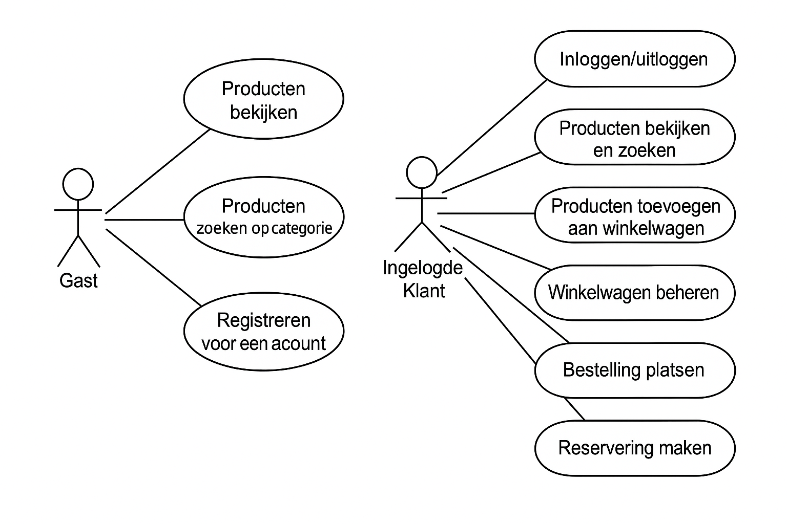
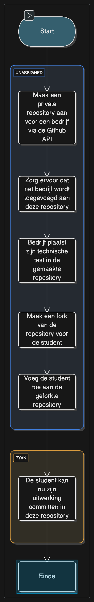

# Webshop - Ontwerp en Onderbouwing

## Database ERD
Het ERD voor de webshop omvat zes entiteiten die de kernfuncties van het platform vertegenwoordigen:
- **Users** (Gebruikers)
- **Producten** 
- **Bestellingen**
- **Bestelregels**
- **Winkelwagens**
- **Reserveringen**

### Entiteit Beschrijvingen:

**Users**: Geregistreerde gebruikers van de webshop
- id (Primary Key)
- username (Uniek)
- password (Versleuteld)
- email (Uniek)
- created_at (Tijdstempel)

**Producten**: Alle items die verkocht worden
- id (Primary Key) 
- naam
- prijs
- beschrijving
- categorie (Voorgerechten, Hoofdgerechten, Desserts, Dranken)

**Bestellingen**: Geplaatste orders van klanten
- id (Primary Key)
- naam, email, telefoon (Klantgegevens)
- adres, postcode, plaats (Leveringsadres)
- totaalbedrag
- status (nieuw, in_behandeling, verzonden, afgerond)
- betaalwijze
- besteldatum

**Bestelregels**: Individuele items binnen een bestelling
- id (Primary Key)
- bestelling_id (Foreign Key naar Bestellingen)
- product_id (Foreign Key naar Producten)
- aantal
- prijs_per_stuk

**Winkelwagens**: Tijdelijke opslag van geselecteerde producten
- id (Primary Key)
- sessie_id (Voor niet-ingelogde gebruikers)
- product_id (Foreign Key naar Producten)
- aantal
- toegevoegd_op

**Reserveringen**: Tafelreserveringen voor het restaurant
- id (Primary Key)
- naam
- email
- datum
- aantal_personen

### Relaties:
- **Bestellingen** en **Bestelregels**: 1-op-n (Een bestelling kan meerdere items bevatten)
- **Producten** en **Bestelregels**: 1-op-n (Een product kan in meerdere bestelregels voorkomen)
- **Producten** en **Winkelwagens**: 1-op-n (Een product kan in meerdere winkelwagens zitten)

## Use Case Diagram
Ons use case diagram illustreert de interacties van twee actoren (Gast, Ingelogde Klant) met het webshop systeem:

### Gast/Bezoeker:
- Producten bekijken
- Producten zoeken op categorie
- Registreren voor een account

### Ingelogde Klant:
- Inloggen/uitloggen
- Producten bekijken en zoeken
- Producten toevoegen aan winkelwagen
- Winkelwagen beheren (aantal aanpassen, items verwijderen)
- Bestelling plaatsen
- Reservering maken
- Account beheren

## Proces Flowchart

### Bestelproces Flowchart
De flowchart toont het complete proces van productweergave tot bestelling:

1. **Start** → Gebruiker bezoekt website
2. **Producten bekijken** → Browse door categorieën
3. **Product selecteren** → Klik op gewenst product
4. **Ingelogd?** → Check of gebruiker is ingelogd
   - Nee → Ga naar registratie/login
   - Ja → Ga verder
5. **Toevoegen aan winkelwagen** → Product wordt opgeslagen
6. **Meer producten?** → Wil gebruiker meer producten?
   - Ja → Terug naar producten bekijken
   - Nee → Ga naar checkout
7. **Checkout** → Bevestig winkelwagen inhoud
8. **Leveringsgegevens** → Vul adres en contactinfo in
9. **Betaalwijze** → Kies betalingsmethode
10. **Bevestigen** → Plaats definitieve bestelling
11. **Bestelling aangemaakt** → Systeem maakt bestelregels
12. **Einde** → Bevestigingsmail wordt verstuurd

### Reserveringsproces Flowchart
Het proces voor het maken van een reservering:

1. **Start** → Ga naar reserveringspagina
2. **Ingelogd?** → Check of gebruiker is ingelogd
   - Nee → Login/registratie vereist
   - Ja → Ga verder
3. **Datum selecteren** → Kies gewenste datum en tijd
4. **Beschikbaarheid checken** → Controleer of datum vrij is
   - Niet beschikbaar → Kies andere datum
   - Beschikbaar → Ga verder
5. **Aantal personen** → Geef aantal gasten op
6. **Contactgegevens** → Bevestig naam en email
7. **Bevestigen** → Maak reservering definitief
8. **Reservering opgeslagen** → Data wordt opgeslagen in database
9. **Einde** → Bevestigingsmail wordt verstuurd

## Onderbouwing

### Ethiek, Privacy en Security

#### Ethiek
- **Eerlijke Prijzen**: Transparante prijsstelling zonder verborgen kosten voor alle klanten
- **Toegankelijkheid**: De webshop is toegankelijk voor gebruikers met verschillende beperkingen

#### Privacy
- **Gegevensbescherming**: Persoonlijke gegevens van klanten worden veilig opgeslagen volgens GDPR richtlijnen
- **Beperkte Toegang**: Alleen noodzakelijke gegevens worden verzameld voor het bestelproces
- **Cookiebeleid**: Duidelijke informatie over het gebruik van cookies

#### Security
- **HTTPS**: Alle communicatie verloopt via versleutelde verbindingen
- **Wachtwoord Beveiliging**: Wachtwoorden worden gehashed opgeslagen met bcrypt
- **Sessie Beveiliging**: Veilige sessie handling om ongeautoriseerde toegang te voorkomen
- **Input Validatie**: Alle gebruikersinvoer wordt gevalideerd tegen SQL injection en XSS aanvallen
- **Supabase Security**: Gebruik van Supabase Row Level Security (RLS) voor database toegang

#### Technische Keuzes
- **PostgreSQL Database**: Betrouwbare en schaalbare database via Supabase
- **PHP Backend**: Bekende en stabiele servertaal voor webapplicaties
- **Responsive Design**: Optimaal werkend op alle apparaten
- **RESTful API**: Duidelijke en logische API endpoints

---