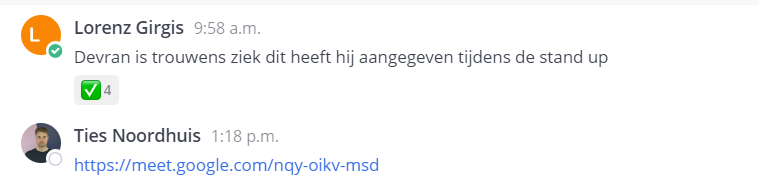
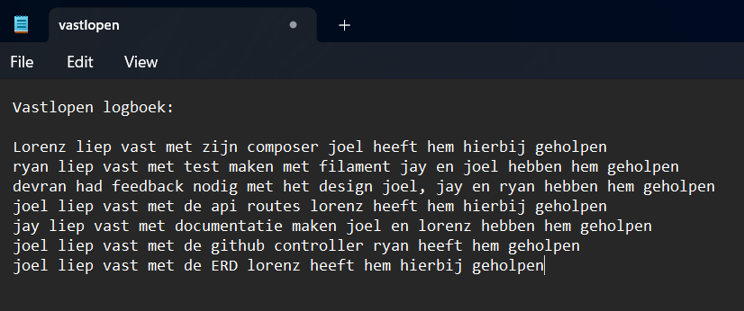
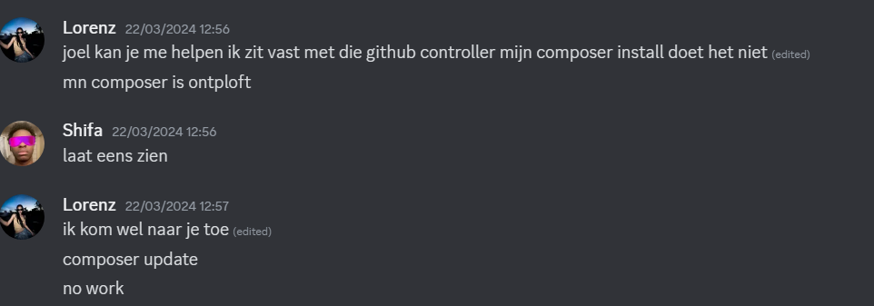
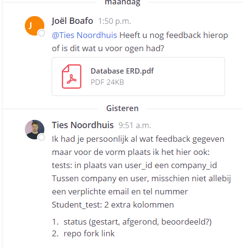
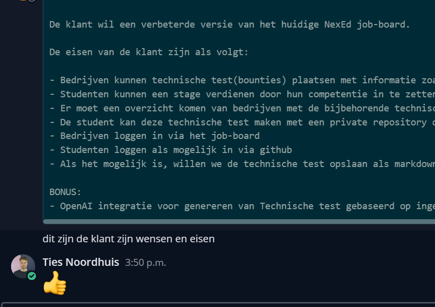

# Bit Bounties - Voert overleg

## Daily stand up
[Daily stand up](https://youtu.be/fjNurRmsUss)

## Overleg sessie Sprint review & Retrospective
[Sprint review](https://www.youtube.com/watch?v=_2XnUbSZpRI)

[Retrospective](08-Reflecteert-op-het-werk/Senditt___Retrospective_Week_13.mp4)

## Afspraken

## Afspraak 1: Melding van Ziekte
- **Specifiek**: Teamleden moeten ziekte melden bij de temlden uiterlijk voor 10:00 uur op de dag van afwezigheid.
- **Meetbaar**: Registratie van ziektemeldingen wordt bijgehouden door de projectmanager.
- **Acceptabel**: Alle teamleden zijn akkoord gegaan met deze procedure tijdens de retrospective meeting.
- **Realistisch**: Teamleden hebben toegang tot een online communicatietool (Whatsapp) waarin zij hun ziekte kunnen melden.
- **Tijdgebonden**: Vanaf de start van het project moet deze procedure worden gevolgd.

    

## Afspraak 2: Overleggen bij Vastlopen
- **Specifiek**: Indien een teamlid vastloopt op een taak, moet die gene hulp zoeken bij een teamlid of een coach.
- **Meetbaar**: Een logboek wordt bijgehouden door de teamleden waarin alle gevallen van vastlopen en de bijbehorende geholpen teamleden worden geregistreerd.
- **Acceptabel**: Deze afspraak is bevestigd door alle teamleden tijdens de retrospective meeting.
- **Realistisch**: Er zijn wekelijkse check-ins gepland waarbij problemen besproken kunnen worden(Sprint-reviews).
- **Tijdgebonden**: Gedurende het gehele project dient deze procedure gevolgd te worden.

## Afspraak 3: Implementatie van Nieuwe Ideeën
- **Specifiek**: Alle nieuwe ideeën voor het project moeten eerst goedgekeurd worden door de projectmanager voordat ze geïmplementeerd worden.
- **Meetbaar**: Een register wordt bijgehouden door de projectmanager met alle voorgestelde ideeën en hun goedkeuringsstatus.
- **Acceptabel**: Tijdens de projectstartbijeenkomst is overeengekomen dat nieuwe ideeën voorafgaande goedkeuring vereisen.
- **Realistisch**: Teamleden kunnen ideeën indienen tijdens de wekelijkse projectmeetings of via mattermost.
- **Tijdgebonden**: Deze regel is van kracht gedurende het gehele project.

